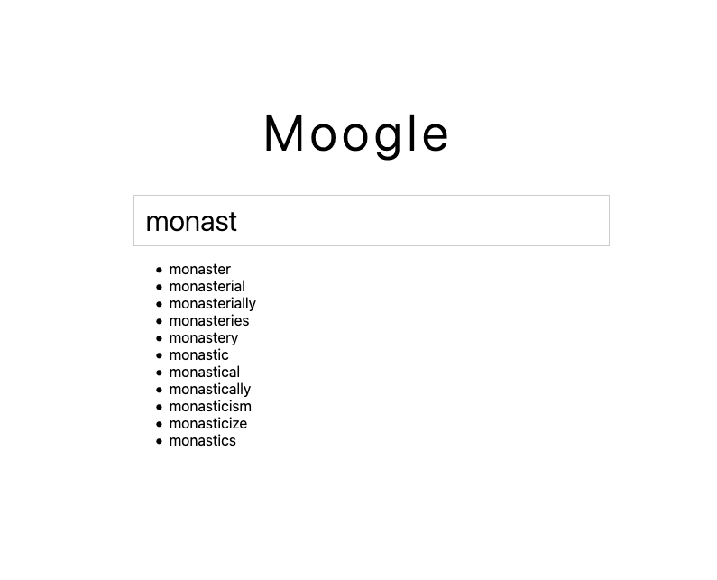

# Moogle

An implementation of [typeahead](https://en.wikipedia.org/wiki/Typeahead) using
a Go HTTP backend and a React frontend.

## Dependencies

- [Go](https://golang.org/doc/install)
- [Node.js](https://nodejs.org/en/)

## Getting started

1. Checkout the repository

```sh
git clone https://github.com/mickaelpham/typeahead
cd typeahead
```

2. Build and run the server

```sh
cd server
go build
./server
```

3. In a separate terminal window, build and run the client

```sh
cd ../client
yarn install
yarn start
```

## Screenshot

After running `yarn start`, your browser should open http://localhost:3000



## Caveats and Improvements

- Currently, the frontend fires a requests for every character typed. I need to
  implement a timer to wait a reasonable amount of time, e.g., 50 ms, before
  sending a new request.
- Similarly, if two requests are fired in short intervals, it is possible that
  request 2 will come back **before** request 1. This can create a problem in
  the display, when the user typed `foo`, which fires request 1, then complete
  with the `l` letter (current input: `fool`), which fires request 2. We
  **do not want** results from request 1 to be displayed, since they might
  contain incorrect suggestions (such as `food`).
- The prefix tree (trie tree) in the backend is very simplistic and could be
  largely optimized by storing the top 10 suggestions for the given prefix. This
  will be implemented as a follow up.
